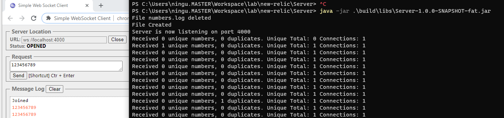

# Code Challenge

This Repository contains the code for running the [Code Challenge]() specified by the interviewers. 

## Overview

The challenge consists of implementing a WebSocket server which listens for incoming messages, filter and writes them to a file. Any programming language can be used but the use of known frameworks is forbidden.

Even if it is out of the scope I made a WebSocket client for load testing the server. Both services, server and client can be found in this repo.

## Run the Challenge

There are 2 services in this repo. The Server and the Client. First, we switch on the Server, and then we can start up the clients. 

Instructions for running each service can be found in their respective folders.

## Design Considerations

As a DevOps/SRE profile, for the last 3 years, I have been managing applications at scale, over distributed platforms. The development of services such as this challenge has been out of my scope. However, I know or should know the right patterns for designing such WebSocket server. That said, I apologize for my coding skills.

### NETTY

Since the tech community was aware of Moore's law coming to an end, as we were not supposed to increase CPU performance over time, asynchronous patterns became more popular. The idea behind asynchronous programming is to avoid the CPU being idle while waiting for a result, a result that may come from another CPU core(as nowadays we have more than a core in the CPU) or from an external service. Asynchronous code is also known as a non-blocking code.

Since I feel confident just with Java and Python programming languages, and having heard that Java outperforms Python in terms of throughput I will go the Java way. In the Java community, Netty has become the most popular framework for asynchronous client/servers. That will be my first consideration. 

### Vertx

Dealing with asynchronism means dealing with threads. This is really challenging, designing optimal thread management is something that requires high expertise as a Software Engineer. Not my case. There are some frameworks and libraries that I used before under Spring that simplify asynchronous programming, like RxJava2 and Reactor. But for this challenge, as the use of *frameworks* is not allowed, Vertx came to my mind (Vertx is not considered a framework but a toolkit). It took me a while adopting Vertx mindset, but the read of their docs has been a pleasure. 

However, as I am not a good programmer, the code is a mix of callbacks hell and fluently code. Somehow the readability could be improved using RxJava2.

### Testing

I must confess I set up the working environment after a brief read of the challenge document. I did not realize the proposal of using telnet for testing purposes. So I google "WebSocket tester" and a Chrome extension shows as the simplest way for validating message and connection logics as described in the challenge document. 

However, this extension performs differently to the Telnet's way. This client is actually sending an HTTP update request to the server to set up a WebSocket connection. As Vertx toolkit provides the automation of these configurations and provides a set of useful handlers for code simplicity I have gone this way without acknowledging that the use of telnet would be affected as a testing tool. 

For load testing, the chrome extension is not valid. I googled again for a simple tool to generate the load test. At a first glance, nothing seems to be suitable for my use case, I need to create a stream of, randomly generated, 9 digit numbers. So, even if it is out of the scope, I made a Websocket client with Vertx that can be found in this repository.

## Misc.

I must confess that I don't feel confident with all the statements I made. I am more interested in the Kubernetes ecosystem and platform services in general. However, this challenge has given me the aims to improve and refresh some concepts and I took it seriously but for my own satisfaction to understand.

