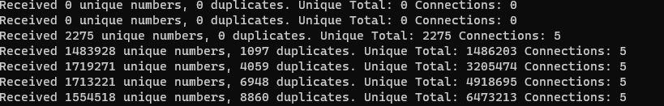

= Server

image:https://img.shields.io/badge/vert.x-3.9.4-purple.svg[link="https://vertx.io"]

This application was generated using http://start.vertx.io and I will keep asciidoc, in markdown extension detriment, to honor Vertx starter which actually helps setting up the gradle plugins and tasks.

== Building

Vertx starter provides us with a gradle wrapper. So I recommend using it to run building tasks so we all share the same gradle settings.

To package your application, the simplest way is the use of
https://github.com/johnrengelman/shadow[Jonh Engelman's shadow plugin], provided by vertx starter and broadly used, this plugin is responsible for packaging the java classes into a single binary called the FatJar. This is not ideal for security and performance reasons but it is the easiest and fastest way to package a Java microservice.
```
./gradlew clean shadowJar

```

To run your application:
```
./gradlew clean run
```

But once the app has been packaged as FatJar, we can also avoid starting gradle daemons and simply run:
```
java -jar build/libs/Server-1.0.0-SNAPSHOT-fat.jar
```
Beware of java 11 running environment requirement.

== WebServer design
=== Vertx Verticle Class
Vertx requires some conventions in the way it initializes. Every Vertx application contains at least one Verticle which holds the event loop that is used internally for the asynchronous threads management.

[source,java]
-----------------
public class MainVerticle extends AbstractVerticle {

public static void main(String args[]) {
    Vertx vertx = Vertx.vertx();
    vertx.deployVerticle(new MainVerticle());
  }

  @Override
  public void start(Promise<Void> startPromise) throws Exception {
-----------------

=== Writing the file
Once again Vertx comes to the rescue making it easy to pipe streams. Using the AsyncFile Writer Stream the goal should be to pipe the socket readStream to the file WriteStream. I will cover this later.

There is a consideration for the challenge. The file has to be reinitialized or blanked every time the server starts up.
[source,java]
-----------------
  private void startChallenge(Vertx vertx) {
    vertx.fileSystem().delete("numbers.log", delete -> {
      if (delete.succeeded()) {
        System.out.println("File numbers.log deleted");
        vertx.fileSystem().open(...
      } else {
        System.out.println("Failed to delete ");
        vertx.fileSystem().open(...
      }
-----------------

=== HTTP Server and Socket Handlers
Vertx is an event-driven toolkit, which means that it provides you utilities to handle different kinds of events. The ones we want are WebSocket events over an HTTP server.

Creating the server is straight forward as I won't consider any security capabilities nor HTTP protocols.
Something as simple as these lines should be enough
[source,java]
-----------------
  private void startServer(Vertx vertx) {
    HttpServer server = vertx.createHttpServer(options);
    server.webSocketHandler(ws -> { // Handles Socket connections (After an update request)
      ws.textMessageHandler(message -> { // Handles websockets incoming messages
-----------------
=== Data Structures
For the challenge's "business logic" I need to store the digits inside a data structure. The digits came as a 9 character string with 0's as left pad. Otherwise, the connection is closed^1^. Computationally the fastest comparator is comparing integers, so if I want to compare if arriving digits have been processed before I better store the digits as Integers. Moreover, 9 digits are many possible numbers so I need a list that grows in size dynamically, at least is something I would not like to tune.

There is another consideration for choosing the right data structure. The searching algorithm. Usually, a linear search is enough for a good performance, but in this challenge, the number of stored digits can grow up to millions, and a linear search over 70M is non-sense, with a significant impact on the performance. That's why I need a data structure that allows me to do a binary search. Binary search works over an ordered list, and in Java 11 the data structure that fills my requirements seems te be a *SortedSet<Integer>*

With a small impact on adding new elements to the list, as they are stored in a sorted manner, the search response is highly improved.

^1^ Line ending: The challenge emphasizes the line ending issue. I have not implemented it as Vertx's handlers abstracts this logic. As mentioned on repo's readme, I have not taken the Telnet path for WebSockets, but the HTTP update connection request.

=== Non-Blocking and BackPressure
For each incoming message, I need to validate and process it. I need those validations to be run in a non-blocking manner so the thread can continue processing incoming WebSocket messages. Once the validations are done, if it proceeds, the Thread will be told to trigger the write-to-file async event.

Writing to a file is expected to be much slower than the WebSocket throughput, and that will cause the WritingQueue to become full with a catastrophic OOM and the consequent data-loss. To avoid that we need to implement the pump paradigm, also known as back-pressure.
[source,java]
-----------------
if (file.writeQueueFull()) {
  ws.pause(); // pause websocket
  file.drainHandler(done -> { // Triggers when the WriteQueue is no longer full
    ws.resume(); // resume websocket
  });
-----------------
Now our Server is resilient and aware of data loss^2^. In other words, data loss is no longer a concern from the server side but for the client which should have in mind a circuit-breaker approach to prevent data from being lost.

Unfortunately, having a file as a backend doesn't let us scale our server horizontally.

^2^ Write-to-file method should have a fall-back, at least responding to the client(not implemented).

=== Periodic Task
Every ten seconds the server have to print the computation made during this 10seconds slot. Again, Vertx has its tool for scheduled tasks.
[source,java]
-----------------
    // Scheduler (in miliseconds)
    vertx.setPeriodic(10 * 1000, kk -> {
      Future.future(f -> System.out.println("Received " + newDigits + " unique numbers, " + repeatedDigits + " duplicates. Unique Total: " + fileDigits.stream().count() + " Connections: " + connections));
      newDigits = 0;
      repeatedDigits = 0;
    }); // End Scheduler
-----------------

== What we expect
I will describe how I've been testing the service, but you can do it your way. Actually while developing I have been using JetBrains IntelliJ.

Start the server
```
$ java -jar Server/build/libs/Server-1.0.0-SNAPSHOT-fat.jar
File numbers.log deleted
File Created
Server is now listening on port 4000
Received 0 unique numbers, 0 duplicates. Unique Total: 0 Connections: 0
Received 0 unique numbers, 0 duplicates. Unique Total: 0 Connections: 0
```
Start the Clients
```
$ vertx run .\src\main\java\com\nrelic\MainVerticle.java --instances 5
SLF4J: Failed to load class "org.slf4j.impl.StaticLoggerBinder".
SLF4J: Defaulting to no-operation (NOP) logger implementation
SLF4J: See http://www.slf4j.org/codes.html#StaticLoggerBinder for further details.
Connected socket
Connected socket
Connected socket
Connected socket
Connected socket
```
Don't worry about the SLF4J errors as is vertx cli cluster matters that don't bother us.

Come back to the server console
```
...
BackPressure
BackPressure
BackPressure
BackPressure
BackPressure
BackPressure
Received 301389 unique numbers, 77 duplicates. Unique Total: 367390 Connections: 5
```
I print each time a Backpressure event occurs. It's telling the client to hold on.

What if there is no write to file? Just delete that piece of code:



Over a million and a half...

As expected, even if there could be a bunch of performance tunnings, writing to the file is the slowest task and so is the throughput of the *microservice*.
